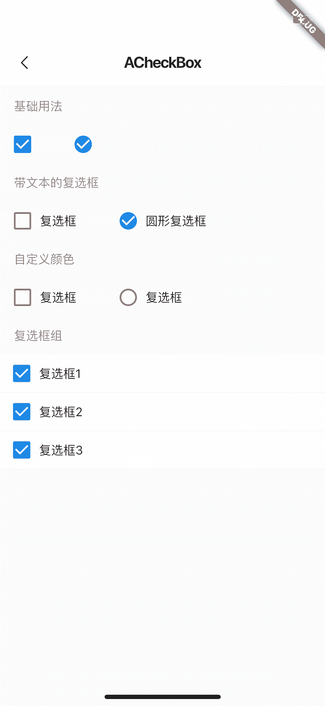

<!--
 * @Author: meetqy
 * @since: 2019-09-02 15:23:17
 * @lastTime: 2019-09-20 14:09:11
 * @LastEditors: meetqy
 -->
# ACheckBox复选框

对项目中使用的复选框进行的封装。



## 基础使用

- 基础使用

``` dart
ACheckBox(
  value: checkbox1,
  onChanged: (bool value) {
    setState(() {
      checkbox1 = value;
    });
  }
)
```

- 带文本的复选框

``` dart
ACheckBox(
  value: checkbox1,
  title: Container(
    margin: EdgeInsets.only(left: 10),
    child: Text('复选框'),
  ),
  onChanged: (bool value) {
    setState(() {
      checkbox1 = value;
    });
  },
)
```

- 圆形复选框

``` dart
ACheckBox(
  radius: Radius.circular(20),
  value: checkbox1,
  title: Container(
    margin: EdgeInsets.only(left: 10),
    child: Text('复选框'),
  ),
  onChanged: (bool value) {
    setState(() {
      checkbox1 = value;
    });
  },
)
```

- 参数 

  
> 注：其他参数和checkbox一样
``` dart
@param {Widget} title - 文本
@param {String} titlePosition - 文本位置  left || right
@param {double} width - 复选框大小
@param {double} strokeWidth - 边框宽度
@param {Raduis} radius - 圆角
@param {MainAxisAlignment} mainAxisAlignment
```