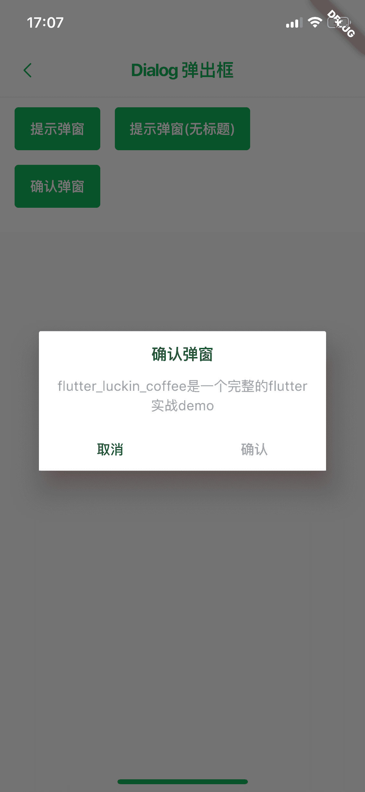

<!--
 * @Author: meetqy
 * @since: 2019-09-02 15:23:17
 * @lastTime: 2019-09-06 17:15:50
 * @LastEditors: meetqy
 -->
# Button按钮

对项目中使用的Stepper按钮进行的一个封装。



## alert 提示弹窗

- 使用

``` dart
ADialog.alert(context,
  title: '提示弹窗',
  content: '代码是写出来给人看的，附带能在机器上运行'
);
```

- 参数

```dart
  @param {BuildContext} context
  @param {String} title - 标题 （标题为null，表示不显示标题）
  @param {String} content - 内容
  @param {Function} confirmButtonPress - 点击确认回调
  @param {Text} confirmButtonText - 确认的文字
```

## confirm 确认弹窗

- 使用

``` dart
ADialog.confirm(context,
  title: '确认弹窗',
  content: 'flutter_luckin_coffee是一个完整的flutter实战demo',
);
```

- 参数

```dart
@param {BuildContext} context
@param {String} title - 标题 （标题为null，表示不显示标题）
@param {String} content - 内容
@param {Function} confirmButtonPress - 点击确认回调
@param {Text} confirmButtonText - 确认的文字
@param {Function} cancelButtonPress - 点击取消回调
@param {Text} cancelButtonText - 取消的文字（null, 不显示改按钮）
```

