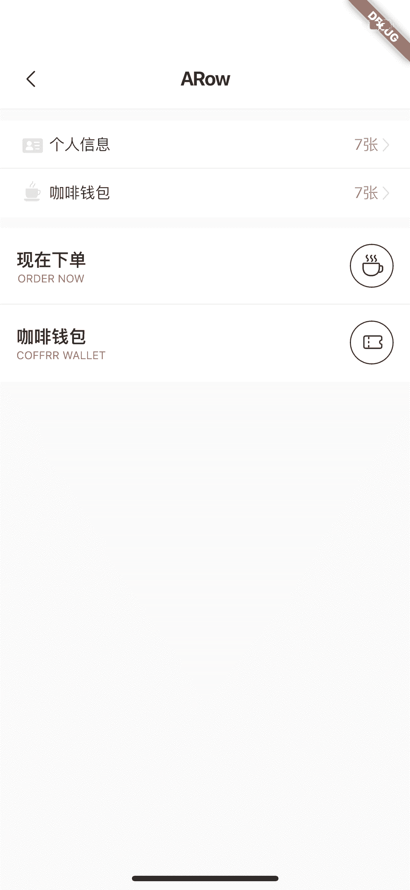

<!--
 * @Author: meetqy
 * @since: 2019-09-02 15:23:17
 * @lastTime: 2019-09-17 11:00:32
 * @LastEditors: meetqy
 -->
# Button按钮

对项目中使用的行进行的一个封装。



- 使用

```
ARow(
  centerChild: Text('这是centerChild')
)
```

- 参数

```dart
@param {double} height 高度
@param {Widget} leftChild 左侧内容
@param {Widget} centerChild 中间内容
@param {Widget} rightChild 右侧内容
@param {EdgeInsets} padding 内边距
@param {Function} onPressed 点击回调
@param {Border} border 
@param {Color} color 
```